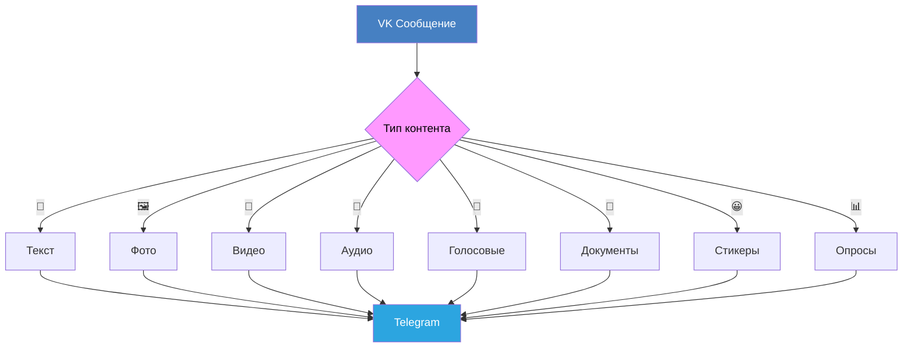

<div align="center">

# 🚀 VK ➡️ TG Forwarder Bot


[](LICENSE)
[](https://www.python.org/)
[](https://vk.com/dev)
[](https://core.telegram.org/bots)
[](https://docs.aiogram.dev/)

[]([https://GitHub.com/Eiztrips/vk-tg-forwarder](https://github.com/Eiztrips/PIM_VK_to_TG/stargazers/)
[](https://github.com/Eiztrips/PIM_VK_to_TG/network/)

**🌉 Мощный мост между VK и Telegram**

[📖 Описание](#-описание) • 
[✨ Особенности](#-особенности) • 
[🚀 Установка](#-установка) • 
[⚙️ Настройка](#%EF%B8%8F-настройка) • 
[🎯 Использование](#-использование) • 
[📱 Демонстрация](#-демонстрация) • 
[🤝 Вклад](#-вклад-в-проект)

---

</div>

## 📖 Описание

> 🎯 **Автоматизируйте свою коммуникацию между платформами!**

**VK ➡️ TG Forwarder Bot** — это интеллектуальный бот для **автоматической пересылки сообщений** из VK чатов в Telegram каналы/группы. Поддерживает **все типы контента** с сохранением структуры и метаданных.

<details>
<summary>🔍 <b>Зачем это нужно?</b></summary>

- 📱 **Централизация коммуникации** — объедините все важные сообщения в одном месте
- 🔄 **Автоматическая синхронизация** — никогда не пропустите важную информацию
- 👥 **Управление сообществами** — идеально для админов групп в обеих платформах
- 📊 **Сохранение истории** — полная история сообщений с метаданными
- 🎨 **Красивое форматирование** — сообщения выглядят естественно в Telegram

</details>

---

## ✨ Особенности

<table>
<tr>
<td width="50%">

### 🔄 **Типы контента**
- [x] 📝 Текстовые сообщения с форматированием
- [x] 🖼️ Фотографии (одиночные и альбомы)
- [x] 🎥 Видео с автоматическими ссылками
- [x] 🎵 Аудиофайлы с метаданными
- [x] 🎤 Голосовые сообщения
- [x] 📄 Документы и файлы
- [x] 😀 Стикеры
- [x] 📌 Записи со стены VK
- [x] 📊 Опросы
- [x] 📤 Пересланные сообщения

</td>
<td width="50%">

### ⚡ **Продвинутые функции**
- [x] 🎯 Умная группировка медиафайлов
- [x] 👤 Сохранение информации об авторе
- [x] 🔗 Интерактивные кнопки для документов
- [x] 📱 Адаптивное форматирование
- [x] 🛡️ Обработка ошибок и восстановление
- [x] 📋 Подробное логирование
- [x] ⚙️ Простая настройка через .env
- [x] 🔄 Real-time синхронизация
- [x] 🎨 Красивые уведомления

</td>
</tr>
</table>

---

## 🚀 Установка

### 📋 Предварительные требования

<details>
<summary>📦 <b>Что нужно подготовить</b></summary>

| Требование | Версия | Описание |
|------------|--------|----------|
| 🐍 Python | 3.10+ | Основной язык программирования |
| 🔑 VK Token | API v5.131+ | Токен для доступа к VK API |
| 🤖 TG Bot Token | Bot API | Токен Telegram бота |
| 💬 Chat IDs | - | ID чатов VK и Telegram |

</details>

### 📥 Способ 1: Git Clone

```bash
# 📂 Клонирование репозитория
git clone https://github.com/Eiztrips/vk-tg-forwarder.git
cd vk-tg-forwarder

# 🐍 Создание виртуального окружения
python -m venv venv

# 🔧 Активация окружения
source venv/bin/activate  # 🐧 Linux/Mac
# или
venv\Scripts\activate     # 🪟 Windows

# 📦 Установка зависимостей
pip install -r requirements.txt
```

### 🐳 Способ 2: Docker

```bash
# 📂 Клонирование и переход
git clone https://github.com/Eiztrips/vk-tg-forwarder.git
cd vk-tg-forwarder

# 🔨 Сборка образа
docker build -t vk-tg-forwarder .

# 🚀 Запуск контейнера
docker run -d --name vk-tg-bot --env-file .env vk-tg-forwarder
```

---

## ⚙️ Настройка

### 🔧 Создание конфигурации

Создайте файл `.env` в корневой директории:

```env
# 🔑 Токены доступа
TG_BOT_TOKEN=1234567890:ABCdefGHijklMNopQRstUVwxYZ123456789
VK_BOT_TOKEN=vk1.a.1234567890abcdef1234567890abcdef...

# 💬 ID чатов
TG_CHAT_ID=-1001234567890     # ID Telegram чата/канала
VK_CHAT_ID=2000000001         # ID VK беседы

# 🏢 ID группы VK для LongPoll
VK_GROUP_ID=123456789         # Числовой ID без минуса

# ⏱️ Интервал опроса (секунды)
POLL_INTERVAL=5
```

### 🤖 Получение токенов

<details>
<summary>🔵 <b>Telegram Bot Token</b></summary>

1. 💬 Откройте [@BotFather](https://t.me/BotFather)
2. 🆕 Отправьте `/newbot`
3. 📝 Следуйте инструкциям
4. 📋 Скопируйте токен
5. ➕ Добавьте бота в чат
6. 🆔 Получите ID чата: [@getidsbot](https://t.me/getidsbot)

</details>

<details>
<summary>🔵 <b>VK Bot Token</b></summary>

1. 🏢 Создайте сообщество VK
2. ⚙️ Перейдите в "Управление" → "Работа с API"
3. 🔑 Создайте ключ доступа с правами на сообщения
4. 📋 Скопируйте токен
5. 🔄 Включите LongPoll API в настройках
6. 💬 Разрешите писать сообщения сообществу

</details>

---

## 🎯 Использование

### 🏃‍♂️ Запуск бота

```bash
# 🔋 Активация окружения
source venv/bin/activate

# 🚀 Старт бота
python src/main.py
```

### 🖥️ Запуск в production

<details>
<summary>🔧 <b>Systemd Service (Linux)</b></summary>

Создайте файл `/etc/systemd/system/vk-tg-forwarder.service`:

```ini
[Unit]
Description=VK to Telegram Forwarder Bot
After=network.target

[Service]
Type=simple
User=your-user
WorkingDirectory=/path/to/vk-tg-forwarder
Environment=PATH=/path/to/venv/bin
ExecStart=/path/to/venv/bin/python src/main.py
Restart=always

[Install]
WantedBy=multi-user.target
```

```bash
# Включение и запуск сервиса
sudo systemctl enable vk-tg-forwarder
sudo systemctl start vk-tg-forwarder
```

</details>

---

## 📱 Демонстрация

<div align="center">

### 🖼️ **Скриншоты работы**

| VK Сообщение | ➡️ | Telegram Результат |
|--------------|----|--------------------|
|  |  |  |

</div>

### 📊 **Поддерживаемые типы контента**



---

## 🏗️ Архитектура

```
📁 project/
├── 📂 src/
│   ├── 📂 client/           # 🔌 API клиенты
│   │   ├── 📄 vk_client.py  # 🔵 VK API клиент
│   │   └── 📄 tg_client.py  # 🔵 Telegram API клиент
│   ├── 📂 util/             # 🛠️ Утилиты
│   │   ├── 📂 logger/       # 📝 Система логирования
│   │   └── 📂 message/      # 💬 Обработка сообщений
│   ├── 📄 config.py         # ⚙️ Конфигурация
│   └── 📄 main.py           # 🚀 Точка входа
├── 📄 .env                  # 🔐 Переменные окружения
├── 📄 requirements.txt      # 📦 Зависимости
└── 📄 README.md            # 📖 Документация
```

---

## 🔧 Поддерживаемые типы сообщений

<table>
<thead>
<tr>
<th width="20%">Тип</th>
<th width="15%">Статус</th>
<th width="65%">Особенности</th>
</tr>
</thead>
<tbody>
<tr>
<td>📝 <b>Текст</b></td>
<td><span style="color: green;">✅ Полная</span></td>
<td>Сохранение форматирования, ссылок и упоминаний</td>
</tr>
<tr>
<td>🖼️ <b>Фото</b></td>
<td><span style="color: green;">✅ Полная</span></td>
<td>Группировка в альбомы, максимальное качество</td>
</tr>
<tr>
<td>🎥 <b>Видео</b></td>
<td><span style="color: green;">✅ Полная</span></td>
<td>Ссылки для просмотра, сохранение метаданных</td>
</tr>
<tr>
<td>📄 <b>Документы</b></td>
<td><span style="color: green;">✅ Полная</span></td>
<td>Группировка, интерактивные кнопки скачивания</td>
</tr>
<tr>
<td>🎤 <b>Голосовые</b></td>
<td><span style="color: green;">✅ Полная</span></td>
<td>Сохранение длительности и качества</td>
</tr>
<tr>
<td>🎵 <b>Аудио</b></td>
<td><span style="color: green;">✅ Полная</span></td>
<td>Метаданные: исполнитель, название, длительность</td>
</tr>
<tr>
<td>😀 <b>Стикеры</b></td>
<td><span style="color: green;">✅ Полная</span></td>
<td>Конвертация в изображения</td>
</tr>
<tr>
<td>📌 <b>Посты стены</b></td>
<td><span style="color: green;">✅ Полная</span></td>
<td>Ссылки на оригинальные посты</td>
</tr>
<tr>
<td>📊 <b>Опросы</b></td>
<td><span style="color: green;">✅ Полная</span></td>
<td>Текстовое представление с результатами</td>
</tr>
<tr>
<td>📤 <b>Пересланные</b></td>
<td><span style="color: green;">✅ Полная</span></td>
<td>Сохранение цепочки авторства</td>
</tr>
</tbody>
</table>

---

## ❓ FAQ

<details>
<summary>🤔 <b>Как получить ID чата VK?</b></summary>

1. Откройте беседу в VK
2. Посмотрите на URL: `https://vk.com/im?sel=c123`
3. ID чата = `2000000000 + 123 = 2000000123`

</details>

<details>
<summary>🤔 <b>Бот не пересылает сообщения</b></summary>

Проверьте:
- ✅ Правильность всех токенов в `.env`
- ✅ Корректность ID чатов
- ✅ Права бота в VK (администратор беседы)
- ✅ Права бота в Telegram (отправка сообщений)
- ✅ Включен ли LongPoll API в VK

</details>

<details>
<summary>🤔 <b>Как обрабатываются большие файлы?</b></summary>

Telegram ограничивает размер файлов до 50 МБ для ботов. Файлы больше этого размера отправляются как ссылки для скачивания с интерактивными кнопками.

</details>

---

## 🐛 Решение проблем

| 🚨 Проблема | 💡 Решение |
|-------------|------------|
| `ModuleNotFoundError` | Установите зависимости: `pip install -r requirements.txt` |
| `Unauthorized` (VK) | Проверьте токен VK и права доступа |
| `Bad Request` (TG) | Убедитесь, что бот добавлен в чат |
| Потеря сообщений | Увеличьте `POLL_INTERVAL` в `.env` |
| Ошибки кодировки | Используйте UTF-8 для всех файлов |

---

## 🤝 Вклад в проект

<div align="center">

**Мы ценим любой вклад в развитие проекта! 🎉**

[](https://github.com/Eiztrips/vk-tg-forwarder/graphs/contributors)

</div>

### 🌟 Как помочь проекту

1. 🍴 **Fork** репозитория
2. 🌿 Создайте ветку: `git checkout -b feature/amazing-feature`
3. 💾 Зафиксируйте изменения: `git commit -m 'Add amazing feature'`
4. 📤 Отправьте в ваш fork: `git push origin feature/amazing-feature`
5. 🔄 Создайте **Pull Request**

### 📋 Roadmap

- [ ] 🔐 Шифрование сообщений
- [ ] 🎨 Настраиваемые темы оформления
- [ ] 🌐 Web интерфейс для управления
- [ ] 📊 Статистика и аналитика
- [ ] 🔄 Двусторонняя синхронизация
- [ ] 📱 Mobile приложение

---

## 📊 Статистика проекта

<div align="center">


</div>

---

## 💝 Поддержать проект

<div align="center">

Если проект оказался полезным, поставьте ⭐!

[](https://buymeacoffee.com/eiztrips)
[](https://paypal.me/eiztrips)

</div>

---

## 📄 Лицензия

Этот проект распространяется под лицензией **MIT**. Подробности в файле [LICENSE](LICENSE).

---

## 👨‍💻 Авторы

<div align="center">

**[Eiztrips](https://github.com/Eiztrips)**

[](https://github.com/Eiztrips)
[](https://t.me/eiztrips)

---

<sub>🚀 Сделано с ❤️ для сообщества открытого ПО</sub>

<br>

**[⬆ Вернуться к началу](#-vk--tg-forwarder-bot)**

</div>
